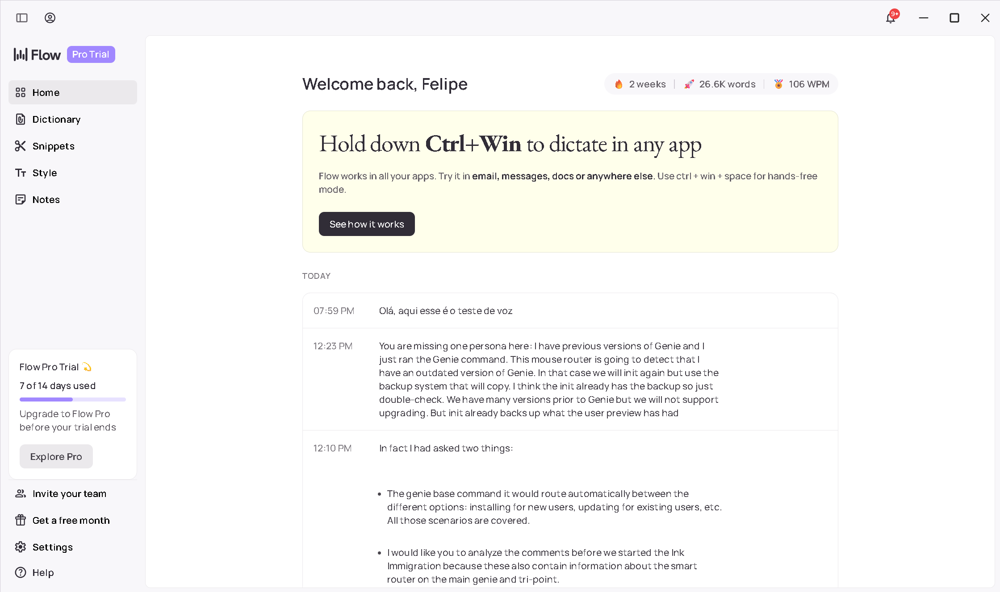

# Speak

> **Your voice, your data, your control** - Open source voice dictation for everyone



## Overview

Speak is an **open-source voice dictation application** built by [Namastex Labs](https://github.com/namastexlabs) that puts **you in control** of your data and workflow. Unlike closed-source alternatives like Wispr Flow, Speak offers complete transparency, privacy-first architecture, and true cross-platform support including Linux.

**What is Speak?**
- 🎤 Universal voice-to-text dictation that works in any application
- 🔓 Open source with full transparency in code and data handling
- 🛡️ Privacy-first: your voice data stays local by default
- 🐧 Native support for Windows, macOS, **and Linux**
- ⚡ Powered by OpenAI Whisper for high-accuracy transcription (>95%)
- 🆓 Unlimited usage - no artificial word limits

### Why Choose Speak?

| Feature | Speak | Wispr Flow |
|---------|-------|------------|
| **Open Source** | ✅ Full transparency | ❌ Closed source |
| **Linux Support** | ✅ Native | ❌ Not available |
| **Privacy** | ✅ Local-first, your choice | ⚠️ Cloud processing, broad usage rights |
| **Offline Mode** | 🔄 Coming Q1 2026 | ❌ Requires internet |
| **Free Tier** | ✅ Unlimited | ⚠️ 2,000 words/week |
| **Self-Hosting** | ✅ Full control | ❌ Not available |

**Key Differentiators:**
- 🔓 **Open Source First** - Full transparency, community-driven
- 🛡️ **Privacy by Design** - Local processing, no mandatory data sharing
- 🐧 **True Cross-Platform** - Windows, macOS, **and Linux**
- ⚡ **No Artificial Limits** - Unlimited usage, your data stays yours

### Key Features

- **Universal Compatibility**: Works in any application via global hotkey (Ctrl+Win)
- **High Accuracy**: Powered by OpenAI's gpt-4o-transcribe model (>95% accuracy)
- **Fast Response**: <2 second latency from recording to text insertion
- **Multi-Language**: Supports 50+ languages automatically
- **Privacy-Focused**: Local processing by default, your data never leaves your machine
- **Open Source**: Fully extensible, customizable, and self-hostable
- **Cross-Platform**: Native support for Windows, macOS, and Linux
- **No Usage Limits**: Dictate as much as you want, forever free

### Current Status

**Phase 1 - Development**: Building production-ready MVP

See [Roadmap](./docs/roadmap.md) for detailed development plan and feature status.

## Quick Start

**🚀 One command setup - 2 minutes to voice dictation:**

```bash
# Clone and run
git clone https://github.com/namastexlabs/speak.git
cd speak
./run.sh
```

That's it! The script will:
- ✅ Check and install dependencies
- ✅ Generate required icons  
- ✅ Configure system dependencies
- ✅ Launch the app with welcome screen

**Manual setup (if you prefer):**

1. Clone repository: `git clone https://github.com/namastexlabs/speak.git`
2. Install dependencies: `npm install`
3. Generate icons: `npm run generate-icons`
4. Start app: `npm start`

[📖 Complete Getting Started Guide](./docs/getting-started.md)

### Prerequisites

- **Node.js 18+** (auto-checked by run.sh)
- **Microphone** (built-in or external)
- **OpenAI API key** (configure in app after launch)

### Installation Options

**Option 1: Automated (Recommended)**
```bash
./run.sh          # Production mode
./run.sh dev      # Development mode
```

**Option 2: Step-by-step**
```bash
# 1. Install Node.js dependencies
npm install

# 2. Generate app icons
npm run generate-icons

# 3. Start the app
npm start
```

### Development Setup

```bash
# Clone repository
git clone https://github.com/namastexlabs/speak.git
cd speak

# Quick start (handles everything)
./run.sh dev

# Or manual setup
npm install
npm run generate-icons
npm run dev
```

### Environment Variables (Optional)

Create `.env` file for development:
```bash
cp .env.example .env
# Edit .env and add your OPENAI_API_KEY
```

**Available scripts:**
- `./run.sh` - Production entry point (recommended)
- `./run.sh dev` - Development mode with DevTools
- `npm run validate` - Check all dependencies
- `npm run check-deps` - Dependency verification
- `npm run generate-icons` - Create app icons
- `npm run lint` - Code linting

## How It Works

1. **Activate**: Hold Ctrl+Win (or your custom hotkey)
2. **Speak**: Clearly dictate your text
3. **Release**: Let go of the keys when done
4. **Result**: Transcribed text appears at your cursor within 2 seconds

## Documentation

### Getting Started
- **[Why Speak?](./docs/why-speak.md)** - Comparison with Wispr Flow and key differentiators
- **[Getting Started](./docs/getting-started.md)** - Platform-specific installation and setup
- **[Privacy & Data](./docs/privacy.md)** - How we handle your data and permissions
- **[Troubleshooting](./docs/troubleshooting.md)** - Common issues and solutions

### Advanced Usage
- **[AI Polishing](./docs/ai-polishing.md)** - Transcription pipeline and customization
- **[Performance Guide](./docs/performance.md)** - Optimizing for noisy environments and long sessions
- **[Roadmap](./docs/roadmap.md)** - Feature status and development timeline

### Technical
- **[Mission](./.genie/product/mission.md)** - Product vision and goals
- **[Tech Stack](./.genie/product/tech-stack.md)** - Architecture and technologies
- **[Environment](./.genie/product/environment.md)** - Development setup guide
- **[Brand Guidelines](./docs/brand.md)** - Positioning and messaging

## Technology

### Privacy-First Architecture
- **Local Processing**: Audio processed on your device by default
- **Your Choice**: Cloud mode available when you enable it
- **Open Source**: Full transparency in data handling
- **Self-Hosting**: Run everything on your infrastructure (roadmap)

### Core Stack
- **Electron**: Cross-platform desktop framework
- **Node.js**: Runtime environment
- **OpenAI Whisper API**: Speech-to-text engine (optional)
  - Primary: `gpt-4o-transcribe` (high quality)
  - Alternative: `gpt-4o-mini-transcribe` (faster/cheaper)
  - Meeting Mode: `gpt-4o-transcribe-diarize` (speaker identification)
  - Local models: Coming Q1 2026 (no API required)

### Key Libraries
- `openai` - API client (optional)
- `electron-store` - Settings persistence
- `robotjs` - Keyboard automation
- Web Audio API - Browser-native audio recording

See [Tech Stack](./.genie/product/tech-stack.md) for complete details.

## Configuration

### API Key Setup

1. Get your OpenAI API key: https://platform.openai.com/api-keys
2. Open Speak settings (system tray icon → Settings)
3. Enter your API key in "API Configuration"
4. Click "Validate" to test connection
5. Save settings

### Customization

- **Model Selection**: Choose between quality/speed/cost tradeoffs
- **Language**: Set primary language (auto-detected by default)
- **Hotkey**: Customize activation keys
- **Dictionary**: Add custom terms, acronyms, technical vocabulary
- **Prompting**: Improve accuracy with context-specific prompts

See [Environment Guide](./.genie/product/environment.md) for all configuration options.

## Roadmap

### Phase 1 (Current) - Production MVP
- Core transcription functionality
- Global hotkey system
- Settings management
- Speaker diarization (meeting mode)
- Streaming transcription
- Custom vocabulary/prompting

### Phase 2 (Q3 2025) - User Growth
- Offline mode (local models)
- Voice commands (formatting)
- Cloud sync (optional)
- Enhanced statistics
- Performance optimizations

### Phase 3 (Q4 2025) - Enterprise
- Team collaboration features
- Custom model training
- API for integrations
- Mobile companion app

See [Full Roadmap](./.genie/product/roadmap.md) for details.

## Contributing

Speak is built with the Genie AI development framework. Contributions are welcome!

### Development Workflow

```bash
# Create a wish (feature request)
genie wish "Add support for custom voice commands"

# Work gets orchestrated through Genie Forge
# See AGENTS.md for framework details
```

### Reporting Issues

Found a bug? Have a feature request?
- [Open an issue](https://github.com/namastexlabs/speak/issues)
- Join our [Discussions](https://github.com/namastexlabs/speak/discussions)

## License

[MIT License](./LICENSE) - Free to use, modify, and distribute.

## Acknowledgments

- **Inspired by Flow** - Original voice dictation concept and UX patterns
- **Powered by OpenAI Whisper** - Industry-leading speech recognition technology
- **Built with Genie** - AI development framework enabling rapid iteration
- **Community-driven** - Open source development with user needs first

## Why Speak vs Flow?

While inspired by Flow's innovative approach, Speak addresses key limitations:

- **Open Source**: Full transparency vs proprietary codebase
- **Linux Support**: Native Linux experience vs Windows/macOS only
- **Privacy Control**: Local processing by default vs cloud-only
- **No Limits**: Unlimited usage vs artificial word caps
- **Self-Hosting**: Complete infrastructure control vs vendor dependency

[🔍 Learn more about our positioning](./docs/why-speak.md)

## Support

- **Documentation**: See `.genie/product/` folder
- **Issues**: [GitHub Issues](https://github.com/namastexlabs/speak/issues)
- **Discussions**: [GitHub Discussions](https://github.com/namastexlabs/speak/discussions)

---

**Status**: ✅ Phase 1 MVP - Production Ready (v0.1.0)

## Get Involved

- **[⭐ Star on GitHub](https://github.com/namastexlabs/speak)** - Show your support
- **[📖 Read the Docs](./docs/)** - Learn about Speak's unique advantages
- **[🐛 Report Issues](https://github.com/namastexlabs/speak/issues)** - Help improve Speak
- **[💬 Join Discussions](https://github.com/namastexlabs/speak/discussions)** - Connect with the community

## Stay Updated

Follow our progress and join the community:

- **GitHub**: Releases, issues, and development updates
- **Discussions**: Community support and feature requests
- **Documentation**: Comprehensive guides and tutorials

---

*Speak: Your voice, your data, your control - open source voice dictation for everyone.*
